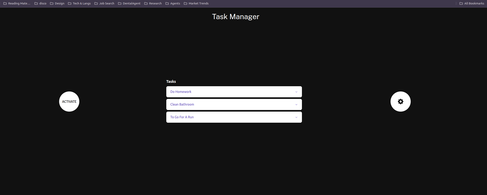
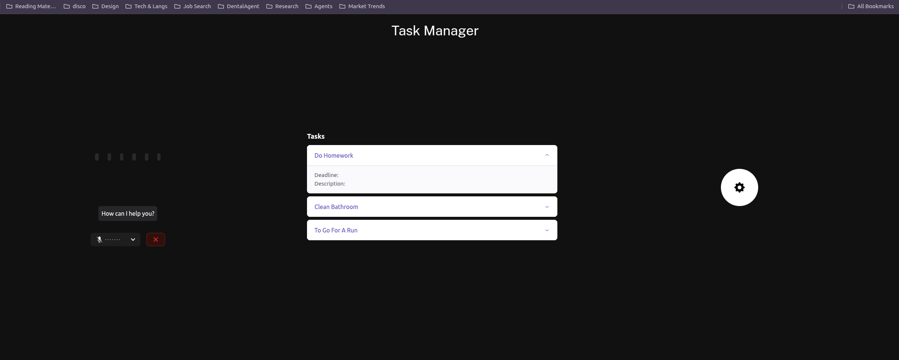

# Task Manager V2 (Beta)

A simple web application for managing tasks using only your voice.

## Getting started

1. Create a `.env.local` file in the webapp dir and set the following key-value pairs:

```
LIVEKIT_URL="ws://localhost:7880"
LIVEKIT_API_KEY="devkey"
LIVEKIT_API_SECRET="secret"

DEEPGRAM_API_KEY="<your_deepgram_key>"
OPENAI_API_KEY="<your_api_key>"
```
2. Create a MongoDB database with the name "task-managment" (use default port). Additionally, create collections called 'tasks' and 'users'.

3. Setup a LiveKit Server (or use the livekit cloud). Start the server with:

```
livekit-server --dev
```
3. Download agent files: `python agent/agent.py download-files`

4. Start the agents: `python agent/agent.py dev`.

4. Start the Next.js app. Navigate to webapp/ and run `npm run dev`.

5. Enter http://localhost:3000 in your browser.

## Sample Images

<div align="center">
  
  <br/>
  <br/>
  <br/>
  
</div>